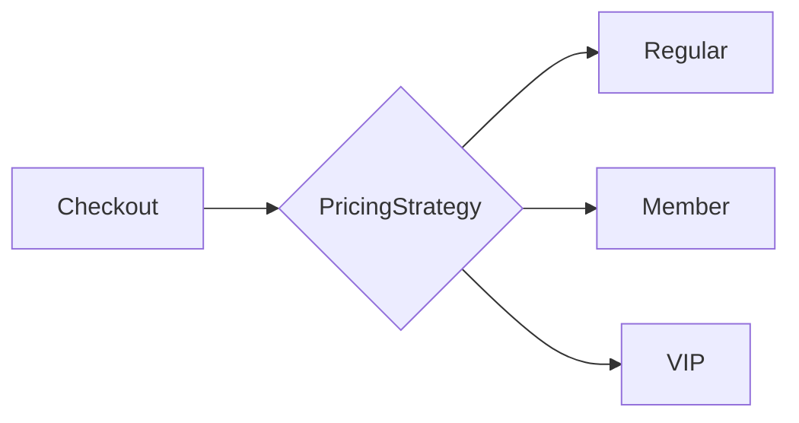

The Strategy pattern turns a family of algorithms into interchangeable objects,
so you can pick behavior at runtime instead of branching on a type.

## The problem it solves

A growing `if/else` or `switch` that chooses behavior is a smell:

```ts
function getPrice(order: Order, customerType: string): number {
  if (customerType === 'regular') return order.total
  if (customerType === 'member') return order.total * 0.9
  if (customerType === 'vip') return order.total * 0.8
  throw new Error('Unknown customer type')
}
```

Every new customer type edits this function — it violates the open/closed
principle.

## The strategy version

```ts
interface PricingStrategy {
  price(order: Order): number
}

const regular: PricingStrategy = { price: o => o.total }
const member: PricingStrategy  = { price: o => o.total * 0.9 }
const vip: PricingStrategy     = { price: o => o.total * 0.8 }

class Checkout {
  constructor(private strategy: PricingStrategy) {}
  total(order: Order) {
    return this.strategy.price(order)
  }
}

new Checkout(vip).total(order)
```

## When it flows



::tip
Adding a new pricing rule now means writing one new object — no existing code
changes. That's the open/closed principle in action.
::

::note
In languages with first-class functions, a strategy is often just a function.
Don't reach for an interface and three classes when a lambda will do.
::
