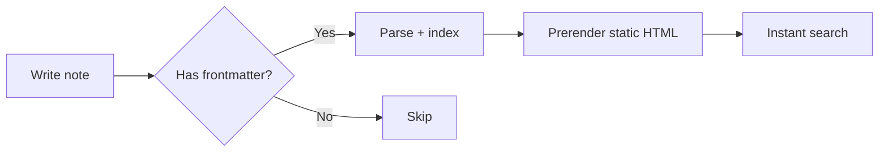
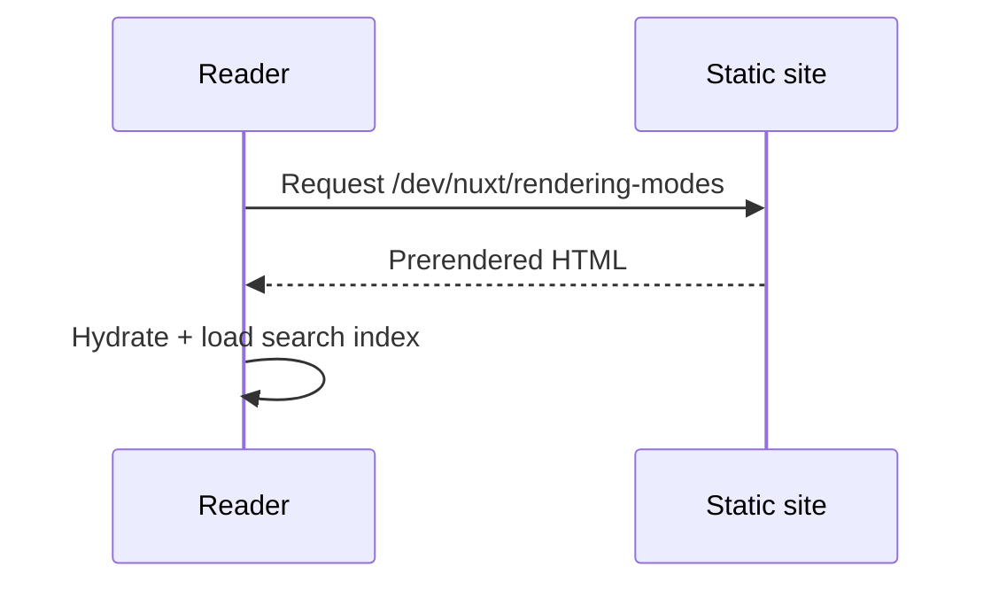

This page exercises every markdown and MDC feature available to notes. Keep it
around — it doubles as a rendering test after any styling change.

## Text formatting

Prose supports **bold**, _italic_, ~~strikethrough~~, `inline code`, and
[internal links](/dev/nuxt/rendering-modes). Press :kbd{value="meta"} :kbd{value="K"}
to search at any time.

> Blockquotes read like a quiet aside — good for definitions or a memorable line.

- Unordered lists
- With several items
  - And nested children
- Back to the top level

1. Ordered steps
2. Follow in sequence
3. Until done

## Callouts

Four semantic callouts cover the situations worth flagging.

::note
A neutral aside — extra context that isn't critical.
::

::tip{icon="i-lucide-zap"}
A shortcut or best practice that saves time.
::

::warning
Something to watch out for before it bites you.
::

::caution
A genuinely destructive or irreversible action.
::

## Code

Fenced blocks get syntax highlighting, an optional filename, line highlights,
and a copy button — in both light and dark themes.

```ts [server/api/hello.ts]{2}
export default defineEventHandler((event) => {
  const name = getQuery(event).name ?? 'world'
  return { message: `hello, ${name}` }
})
```

A PHP block, to confirm non-default languages highlight:

```php [app/Models/User.php]
<?php

namespace App\Models;

class User extends Authenticatable
{
    protected $fillable = ['name', 'email', 'password'];
}
```

### Code groups

Tabbed code for showing the same task across tools:

::code-group

```bash [npm]
npm install @nuxt/content
```

```bash [pnpm]
pnpm add @nuxt/content
```

```bash [bun]
bun add @nuxt/content
```

::

## Tabs

::tabs

::tabs-item{label="Overview" icon="i-lucide-book-open"}
Tabs group related content that the reader only needs one of at a time.
::

::tabs-item{label="Details" icon="i-lucide-list"}
The second panel — switching tabs never loses your scroll position.
::

::

## Collapsible sections

::collapsible{name="the full explanation"}
Hidden by default, this is ideal for long derivations, verbose output, or
answers you don't want to spoil immediately.
::

## Steps

::steps{level="3"}

### Install the dependency

Add the package to your project.

### Configure the module

Register it in `nuxt.config.ts`.

### Restart the dev server

Changes to modules require a fresh start.

::

## Tables

| Command      | Description                    | Reversible |
| ------------ | ------------------------------ | ---------- |
| `git status` | Show the working tree state    | —          |
| `git add`    | Stage changes for commit       | Yes        |
| `git commit` | Record staged changes          | Yes        |
| `git push`   | Publish commits to the remote  | Hard       |

## Badges

Inline status markers: :badge[stable]{color="success"} :badge[beta]{color="warning"} :badge[deprecated]{color="error"}

## Diagrams

Fenced `mermaid` blocks render as diagrams that follow the current theme.



A sequence diagram works too:



## Video

Embed a video responsively without writing raw iframe markup:

::video-embed{src="https://www.youtube.com/watch?v=dQw4w9WgXcQ" title="Example video"}
